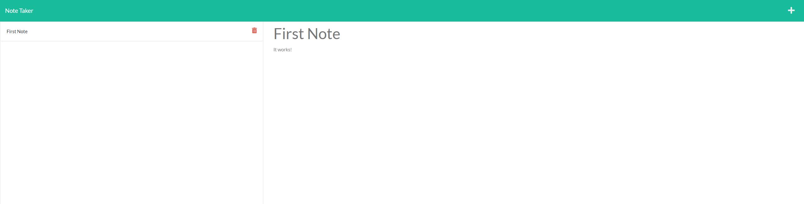

# note-taker

## Description
This application allows users to create notes, view the previous notes, and delete notes that they no longer want. Being deployed to Heroku, visitors can save notes in the browser, and they will be there after the user leaves and returns. 

## License Badge and Link (if applicable)
  
[MIT Link](https://opensource.org/licenses/MIT)

  ## Table of Contents
- [Description](#description)
- [Installation](#installation)
- [Usage](#usage)
- [Screenshot](#screenshot)
- [Contributing](#contributing)
- [Packages](#packages)
- [License](#license)
- [Questions](#githubUser)

## Installation
You can download the files for the site from GitHub by cloning the respository. If you wish to run it locally, open the terminal, run npm install to install all dependencies, and then run npm start. The site should be running on localhost:3001. You can also visit https://note-taker-kdchurch.herokuapp.com/notes to run it from your browser.

## Usage
This site can be used to take notes of whatever you want. It is a great way to stay organized!

## Screenshot

## Contributing
Kyle Church

## Packages
- Node.js: JavaScript runtime built on Chrome's V8 JavaScript engine.
- Express.js: Lightweight framework of Node.js that has many features to make create applications more simplistic. Most notably, allows us to create a server
- UUID: Creates a unique id for each note

## Languages
- JavaScript

## License
MIT

## Questions
- Github Page: [kdchurch1994](https://github.com/kdchurch1994)
- Email: kdchurch@bsu.edu